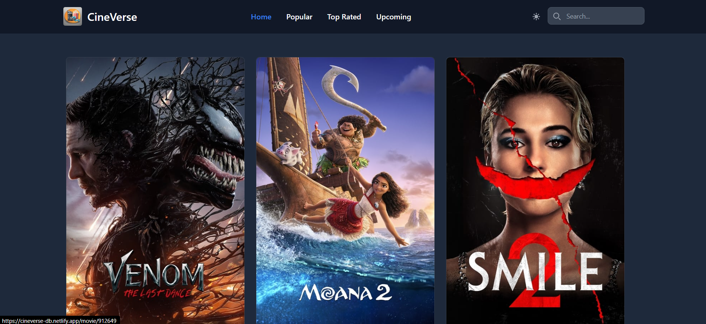
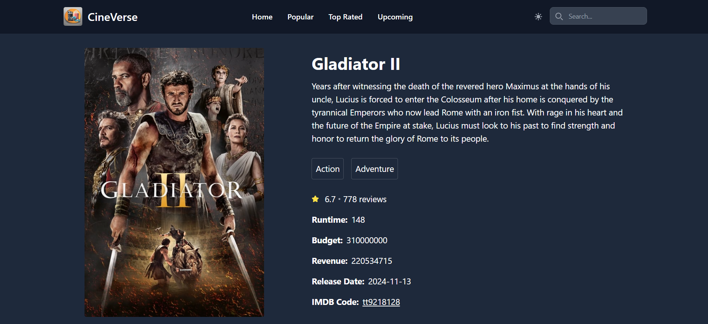
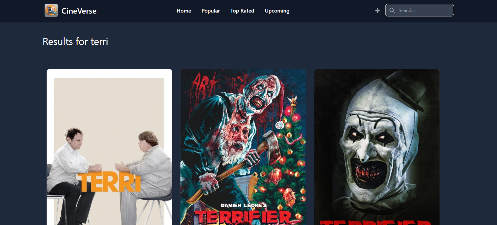
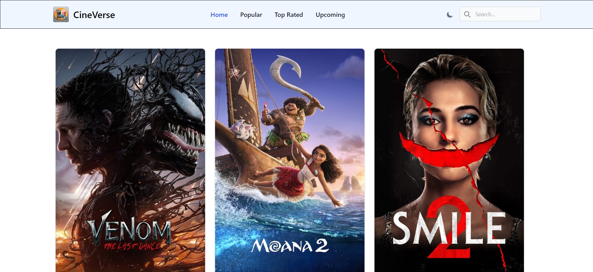
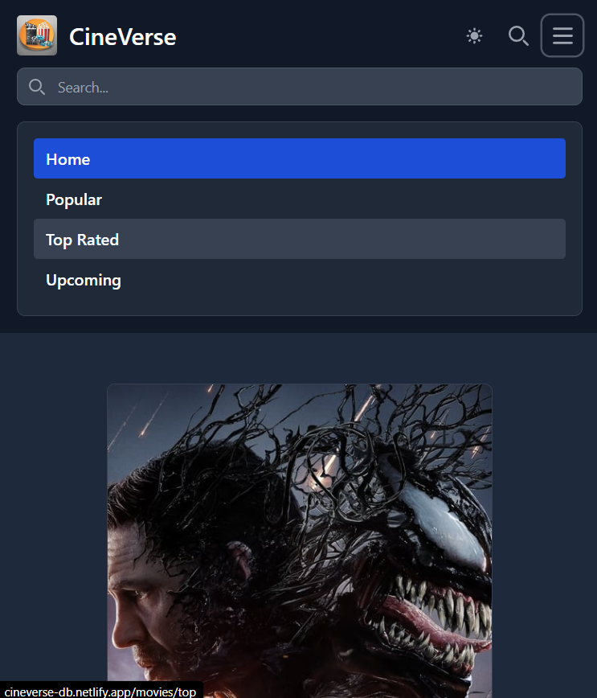

CineVerse 🎥
A modern and responsive movie exploration app built with React JS

🚀 Features
    •	Search for movies: Discover information about your favorite movies.
    •	Responsive design: Optimized for all devices, from mobile to desktop.
    •	Dynamic API Integration: Powered by TMDb API for real-time movie data.
    •	Interactive UI: Built with React components for a smooth and user-friendly experience.
    •	Modern CSS Styling: Using CSS modules for modular and reusable styling.

🛠️ Tech Stack
    •	Frontend: React JS, React Router, JSX
    •	Styling: CSS Modules
    •	API: TMDb API
    •	State Management: React State & Context API
    •	Build Tool: Vite or Create React App (CRA)

Prerequisites
Before you begin, ensure you have met the following requirements:
    •	Node.js installed on your system.
    •	Basic understanding of React.js.
    •	An API key from The Movie Database (TMDb) to fetch data.

🔧 Setup Instructions
1. Clone the repository
    git clone : https://github.com/Katos1950/CineVerse.git

2. Navigate to the Project Directory
    cd CineVerse

3. Install dependencies
    npm install

4. Add TMDb API Key
    •	Create a .env file in the root directory.
    •	Add your API key as:
        REACT_APP_TMDB_API_KEY=your_api_key_here

5. Run the development server
    npm start

6. Build for production
    npm run build

📸 Screenshots
Home Page

Movie Details Page

🗂️ Folder Structure
css
Copy code
Cinemate/
├── src/
│   ├── components/
│   │   ├── Header.jsx
│   │   ├── MovieCard.jsx
│   │   ├── SearchBar.jsx
│   ├── pages/
│   │   ├── Home.jsx
│   │   ├── MovieDetails.jsx
│   ├── styles/
│   │   ├── App.module.css
│   │   ├── Header.module.css
│   ├── App.jsx
│   ├── index.js
├── .env
├── package.json

